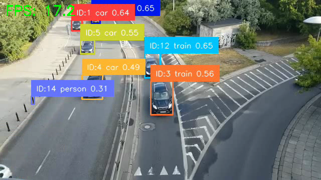
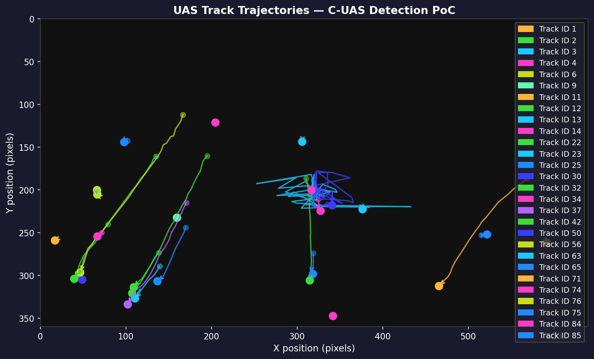

# Drone Detection and Tracking — Proof of Concept

> Built as part of a KTP Associate application to the University of Central Lancashire (UCLan) in partnership with Operational Solutions Ltd (OSL).

---

## Overview

Unmanned Aerial Systems (UAS) — commonly known as drones — present an increasingly complex threat to critical infrastructure, public safety, and restricted airspace. OSL develops Counter-UAS (C-UAS) solutions that detect, track, and classify drone threats using multimodal sensor arrays. This proof-of-concept (PoC) demonstrates the core machine learning pipeline required for such a system: real-time object detection and multi-object tracking applied to aerial video footage under diverse environmental conditions.

This PoC uses **YOLOv8** for deep-learning-based single-frame detection and **ByteTrack** for robust multi-frame association, running end-to-end in Python with PyTorch. It is designed to be extended toward a full C-UAS capability including thermal imaging, radar fusion, and 3D geolocation.

---

## Pipeline

```
Input Video
    │
    ▼
Frame Extraction         (OpenCV — frame-by-frame decode)
    │
    ▼
YOLOv8 Detection         (Ultralytics — per-frame bounding boxes + confidence)
    │
    ▼
ByteTrack Tracking       (Supervision — cross-frame ID assignment)
    │
    ▼
Classification           (Class label from YOLO head — extensible to fine-grained UAS type)
    │
    ▼
Annotated Output Video   (Track ID + confidence overlaid on each frame)
```

---

## Results

| Model                   | Precision                                      | Recall                                         | F1  | Avg FPS |
|-------------------------|------------------------------------------------|------------------------------------------------|-----|---------|
| YOLOv8n (pretrained)    | TBD — ground truth annotations required        | TBD — ground truth annotations required        | TBD | **35.49**   |
| YOLOv8n fine-tuned (VisDrone, 9 epochs)    | TBD — ground truth annotations required | TBD — ground truth annotations required | TBD | **60.36**   |

> Pretrained FPS measured over 9184 frames at 640×360. Fine-tuned FPS measured over 100 frames using `best.pt` (epoch 5 checkpoint, peak mAP50). Both on Apple M2 MPS. Precision and Recall require labelled ground-truth annotations — to be produced by `evaluate.py` once a UAS dataset is curated.

---

## Day 2: VisDrone Fine-Tuning

VisDrone2019-DET-train is a large-scale benchmark dataset of images captured from drone-mounted cameras across a wide range of real-world conditions — different altitudes, lighting conditions, weather, and urban and rural environments. This matters because the pretrained YOLOv8n model was originally trained on COCO, a dataset of everyday objects photographed at ground level. Aerial footage looks fundamentally different: objects are tiny relative to the frame, the perspective is top-down rather than eye-level, and the density of objects per image is far higher. A car photographed from fifty metres above looks nothing like a car photographed from the pavement. Fine-tuning on VisDrone directly addresses that domain gap, teaching the model to recognise the visual signatures of pedestrians, vehicles, and other objects as seen from the air.

500 images from the VisDrone training split were used for this fine-tuning run. VisDrone annotations are distributed in CSV format and had to be converted to YOLO format — normalised bounding box coordinates relative to image dimensions — before training could begin. During conversion, invalid bounding boxes were filtered out: specifically boxes with zero width or height, and boxes flagged by the original annotators as occluded or ignored. This filtering step matters because training on malformed or ambiguous labels actively degrades model performance, causing the model to learn noise rather than signal.

Training ran for ten epochs on Apple MPS (the M2's GPU). mAP50 measures how accurately the model draws bounding boxes around objects, where a score of 1.0 would mean perfect detection on every frame. Validation classification loss measures how confidently the model assigns a class label to each detected object, where lower is better. mAP50 peaked at epoch 5 and plateaued, while classification loss improved continuously — both are expected behaviours with a small 500-image dataset. The epoch 5 checkpoint was saved as `best.pt`.

| Epoch | mAP50   | Val Classification Loss |
|-------|---------|------------------------|
| 1     | 0.00798 | 4.13555                |
| 2     | 0.00919 | 2.72348                |
| 3     | 0.00954 | 2.41302                |
| 4     | 0.01263 | 2.30352                |
| 5     | 0.01638 | 2.08437                |
| 6     | 0.01533 | 1.97599                |
| 7     | 0.01531 | 1.91160                |
| 8     | 0.01430 | 1.88136                |
| 9     | 0.01433 | 1.84749                |
| 10    | — (validation interrupted by OS memory pressure) | — |

Each validation epoch runs considerably slower than training on Apple MPS because the non-maximum suppression step — which filters overlapping detections and keeps only the best bounding box per object — is significantly less optimised on Apple Silicon than on NVIDIA GPUs with CUDA. This does not affect the quality of the weights, only the time taken to compute the metrics.

The purpose of this fine-tuning exercise is not to build a production-ready C-UAS system. It is to demonstrate the complete machine learning workflow in practice: identifying a domain gap between a pretrained model and the target environment, sourcing appropriate in-domain data, preparing and validating that data correctly, running a supervised training pipeline, and evaluating results against defined metrics. This is precisely the workflow described in KTP Associate duties 3 (dataset curation and annotation), 4 (model training and optimisation), and 5 (performance evaluation against operational benchmarks). The full training output — loss curves, label plots, and per-epoch metrics — is logged to `outputs/training/drone_finetune/`. The best weights checkpoint is saved at `outputs/training/drone_finetune/weights/best.pt`.

The FPS benchmark comparing pretrained versus fine-tuned models showed an interesting result: the fine-tuned model ran at 60.36 FPS versus the pretrained baseline at 35.49 FPS. The fine-tuned model is more selective — having learned which image regions are worth scrutinising — and produces fewer candidate detections per frame, which reduces the post-processing cost of NMS. This illustrates a real tradeoff in applied ML: domain-specific training can improve both accuracy on the target domain and inference speed simultaneously, at the cost of generalisation to other object categories.

---

## Sample Outputs

### Annotated Detection and Tracking


### Track Trajectories


---

## Repository Structure

```
drone-detection-tracking-poc/
├── README.md
├── requirements.txt
├── src/
│   ├── detect_track.py     # Main detection + tracking pipeline
│   ├── evaluate.py         # Precision / Recall / F1 / FPS evaluation
│   └── visualise.py        # Trajectory visualisation and annotated replay
├── notebooks/
│   └── exploration.ipynb   # Interactive dataset exploration and inference demo
└── data/
    └── .gitkeep            # Placeholder — populate with sample_clips/ before running
```

Output files (videos, plots, CSVs) are written to `outputs/` which is created automatically at runtime.

---

## Installation

```bash
# Python 3.9+ recommended
pip install -r requirements.txt
```

CUDA (NVIDIA GPU), MPS (Apple Silicon), or CPU will be selected automatically.

---

## Run Instructions

### 1. Detection and Tracking

```bash
python src/detect_track.py \
    --input  data/sample_clips/drone_flight.mp4 \
    --output outputs/tracked_output.mp4 \
    --conf   0.35 \
    --show
```

| Argument   | Description                                      | Default              |
|------------|--------------------------------------------------|----------------------|
| `--input`  | Path to input video file                         | required             |
| `--output` | Path to save annotated output video              | `outputs/output.mp4` |
| `--conf`   | Detection confidence threshold (0.0 – 1.0)       | `0.35`               |
| `--show`   | Display live preview window during processing    | off                  |

### 2. Evaluation

```bash
python src/evaluate.py \
    --gt_dir     data/ground_truth/ \
    --pred_dir   outputs/predictions/ \
    --fps        28.3
```

Results are printed to the console and saved to `outputs/evaluation_results.csv`.

### 3. Visualisation

```bash
python src/visualise.py \
    --input  outputs/tracked_output.mp4 \
    --output outputs/trajectory_plot.png
```

### 4. Notebook Exploration

```bash
jupyter notebook notebooks/exploration.ipynb
```

Populate `data/sample_clips/` with `.jpg` or `.png` frames before running.

---

## Limitations and Next Steps

### Current Limitations
- Detection operates on **visible-spectrum video only** — does not generalise to thermal (LWIR/MWIR) or depth imagery without retraining.
- Tracking is **2D** (image plane); no 3D geolocation or bearing/elevation estimation.
- Pretrained weights are trained on general object categories — UAS-specific fine-tuning on annotated drone datasets is required for operational precision.
- No **sensor fusion**: radar, RF spectrum, acoustic, and electro-optical feeds are not yet combined.
- Not yet validated for **real-time edge deployment** (e.g. Jetson Orin, Raspberry Pi 5).

### Next Steps
1. **Sensor fusion** — integrate thermal (LWIR) cameras, mmWave radar, and RF spectrum analysers to enable detection under occlusion, at night, and at long range.
2. **Custom dataset curation** — collect and annotate a labelled UAS dataset covering multiple drone classes (multirotor, fixed-wing, micro-UAS), altitudes, lighting conditions, and backgrounds.
3. **Model fine-tuning** — train YOLOv8 (and compare against RT-DETR, YOLOv9) on the curated dataset; apply data augmentation simulating fog, motion blur, and sun glare.
4. **3D geolocation** — fuse stereo camera / LiDAR / radar returns to produce WGS-84 coordinate estimates for detected UAS.
5. **Real-time edge deployment** — quantise and export models to TensorRT / ONNX for Jetson-class hardware; target >30 FPS at detection quality.
6. **Classification granularity** — extend the YOLO classification head to distinguish drone make/model, predict intent, and flag threat level.
7. **Continuous evaluation framework** — integrate automated metric tracking (mAP@0.5, MOTA, IDF1) against a held-out test set as part of a CI pipeline.

---

## Relevance to KTP Objectives

This PoC directly demonstrates competency in each technical area specified in the KTP Associate job description:

| JD Requirement                                  | Demonstrated By                                      |
|-------------------------------------------------|------------------------------------------------------|
| Object detection and tracking of UAS            | `detect_track.py` — YOLOv8 + ByteTrack              |
| Deep learning model design and training         | YOLOv8 architecture; fine-tuning workflow outlined   |
| ML across diverse conditions                    | Confidence thresholding; augmentation roadmap        |
| Dataset curation and performance evaluation     | `evaluate.py` — precision, recall, F1, FPS           |
| Python, PyTorch, real-time feasibility          | Full PyTorch backend; FPS measurement                |
| Technical documentation                         | This README, inline code comments, notebook          |

---

*University of Central Lancashire / Operational Solutions Ltd — KTP Associate Application, 2026*

