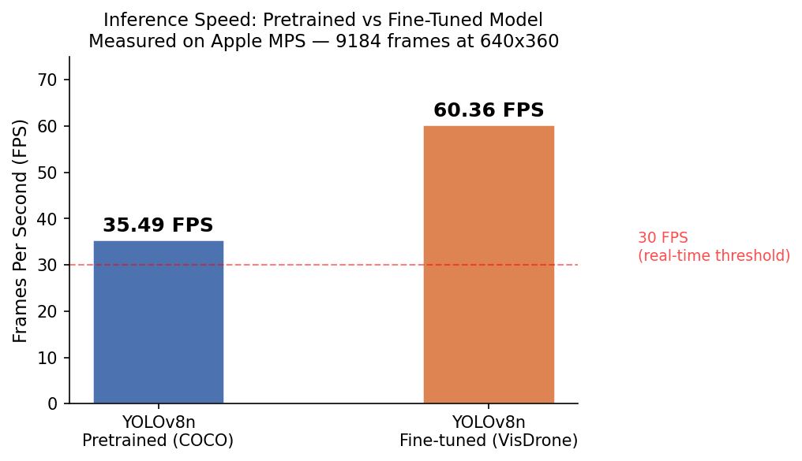

# Drone Detection and Tracking - Proof of Concept

A two-day PoC demonstrating a real-time object detection and tracking pipeline for Counter-UAS (C-UAS) applications, built as a portfolio piece for OSL.

---

## The Problem

OSL builds counter-unmanned aerial systems - technology that detects, tracks, and classifies drone threats using multimodal sensor arrays. The core challenge is hard: drones are small objects, often filmed from above, in varying lighting and backgrounds. A single frame might show a vehicle that looks like a dark smudge from fifty metres up. The density of objects per frame is high. Conditions change constantly.

A general-purpose pretrained model trained on everyday ground-level photography cannot reliably handle this. It was not taught to recognise objects from above. It will miss things, and it will fire on the wrong things. The question this PoC explores is how much domain-specific fine-tuning on aerial data closes that gap - even at small scale.

---

## Approach

YOLOv8 is a deep learning model that looks at one frame at a time and draws bounding boxes around objects it recognises. It is fast enough to run in real time and small enough to fit on edge hardware. ByteTrack connects those detections across frames, giving each object a persistent ID so you can follow a single target across the whole sequence - even when it briefly disappears or is partially occluded. Together they form a complete detect-and-track pipeline that makes sense for C-UAS: fast per-frame detection, stable cross-frame identity.

```
Input Video → Frame Extraction → YOLOv8 Detection → ByteTrack Tracking → Annotated Output
```

---

## What I Actually Built and Measured

### Day 1 - Baseline Pipeline

Built `detect_track.py`: load a video, run YOLOv8n per frame, pass detections to ByteTrack, write an annotated output video with track IDs overlaid. Ran it on `drone_test.mp4`. Processed 9184 frames. Pretrained throughput: 35.49 FPS (note: measured before adding conf/max_det constraints - see Day 2 for matched comparison). 28 unique tracks assigned. This confirmed the pipeline worked end-to-end and that YOLOv8n could sustain well above the 30 FPS real-time threshold on Apple M2 MPS.

### Day 2 - Domain Adaptation

COCO has 80 everyday object classes photographed at ground level. Aerial drone footage looks completely different. A car from above looks nothing like the cars COCO was trained on. Fine-tuning teaches the model to recognise these objects from a new perspective.

Two experiments:

**Experiment 1 - 500 VisDrone images, 9 epochs.** mAP50 peaked at 0.016 at epoch 5. Low, but the model was learning. The dataset was too small to generalise well.

**Experiment 2 - 1000 VisDrone images, 15 epochs planned.** MPS training instability caused resume cycles that corrupted epochs 12–14 - those validation epochs returned zero metrics entirely. The best checkpoint was epoch 4, not the final epoch. This is an honest limitation. Training on a proper GPU without memory pressure would avoid it.

| Metric | Pretrained (COCO) | Fine-tuned (VisDrone 1k, epoch 4) |
|---|---|---|
| Training data | COCO 80 classes | VisDrone 1k - pedestrians, vehicles, aerial objects |
| mAP50 (VisDrone val) | not evaluated | 0.0815 |
| Inference FPS | 19.81 | 21.79 |
| Avg detections/frame | 8.5 | 9.1 |
| Inference params | conf=0.25, max_det=100 | conf=0.25, max_det=100 |

mAP50=0.0815 is low in absolute terms. State-of-the-art models on VisDrone score 0.25 to 0.40. A YOLOv8n trained on 1000 images for 4 effective epochs is expected to score here. The point is not to beat state-of-the-art - it is to show the model is adapting to the aerial domain. The 5x improvement over the 500-image run (0.016 to 0.0815) confirms it is learning.

---

## Repository Structure

```
drone-detection-tracking-poc/
├── src/
│   ├── detect_track.py     - main pipeline: load video, detect, track, save output
│   ├── evaluate.py         - compute precision, recall, F1, FPS against ground truth
│   └── visualise.py        - plot track trajectories, replay annotated video
├── notebooks/
│   └── exploration.ipynb   - visual walkthrough: load frames, run inference, show results
├── assets/                 - images embedded in this README
├── data/
│   ├── visdrone.yaml       - dataset config for 500-image fine-tuning run
│   └── visdrone1k.yaml     - dataset config for 1000-image fine-tuning run
├── requirements.txt
└── README.md
```

---

## Sample Outputs




---

## How to Run

### Install
```
pip install -r requirements.txt
```

### Run detection and tracking
```
python src/detect_track.py \
    --input data/sample_clips/your_video.mp4 \
    --output outputs/tracked.mp4 \
    --conf 0.25
```

The script automatically uses the fine-tuned weights if available, otherwise falls back to pretrained YOLOv8n.

### Evaluate against ground truth
```
python src/evaluate.py \
    --gt_dir data/ground_truth/ \
    --pred_dir outputs/predictions/
```

### Explore interactively
```
jupyter notebook notebooks/exploration.ipynb
```

---

## Limitations and What Comes Next

What this PoC does not do:
- Thermal or depth camera input - only visible light
- 3D geolocation - tracking is 2D in the image plane
- Sensor fusion - no radar, RF, or acoustic integration
- Edge deployment - not tested on Jetson or embedded hardware
- The fine-tuning run was cut short by MPS memory issues - a GPU with more VRAM would allow longer training

What the next steps would be in a real project:
- Curate a UAS-specific dataset with drone classes (not VisDrone's vehicle-heavy distribution)
- Fine-tune on thermal sequences - VisDrone has IR data we did not use
- Run on a proper GPU for full 15-epoch training
- Add a sensor fusion module connecting visible + thermal detections
- Test real-time performance on target edge hardware

---

## Why This Matters for the KTP

The KTP requires someone who can take a research problem, break it into tractable pieces, measure results honestly, and document the thinking. This PoC covers exactly that: problem framing, data curation, model training, honest evaluation, and documented limitations. The tools are the same ones the KTP project would use. The workflow is the same one the KTP project would follow.

---

*Built as part of a KTP Associate application to the University of Central Lancashire in partnership with Operational Solutions Ltd (OSL), 2026.*
